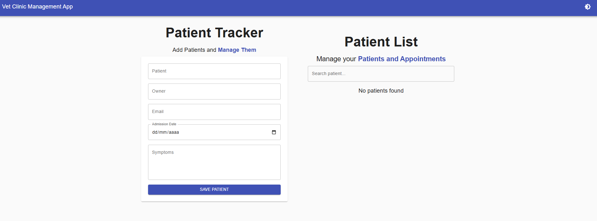
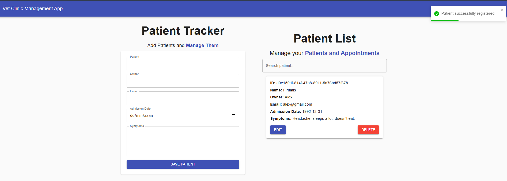
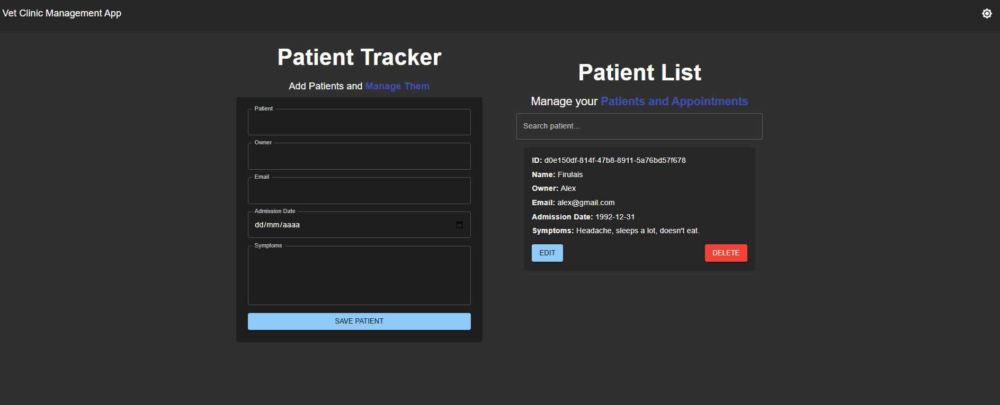

# 🐾 Vet Clinic Dashboard

A **modern veterinary management web app** built with **React**, **TypeScript**,
**Material UI**, **Zustand**, and **React Hook Form**.

It allows users to **register, edit, delete, and analyze patients**, with
persistent dark/light themes, form validation, and responsive UI.  
Designed to simulate a real-world **clinic dashboard** for small practices or
educational purposes.

---

## 🔗 Live Demo

👉 **[View Live App](https://vet-clinic-dashboard.netlify.app/)**

---

## 🧠 Overview

This project demonstrates:

- **State management** with Zustand and persistent localStorage.
- **Reusable components** built in TypeScript.
- **Form validation** and data handling with React Hook Form.
- **Material UI theming** with light/dark mode toggle.
- **Dynamic analytics** using Recharts for monthly patient tracking.
- **Responsive and accessible** design across all screen sizes.

---

## 📸 Screenshots

| Patient Form                      | Patient List                      | Analytics                         |
| --------------------------------- | --------------------------------- | --------------------------------- |
|  |  |  |

---

## 🧩 Tech Stack

| Category               | Technologies                 |
| ---------------------- | ---------------------------- |
| **Frontend**           | React, TypeScript, Vite      |
| **UI Library**         | Material UI                  |
| **State Management**   | Zustand                      |
| **Form Handling**      | React Hook Form              |
| **Data Visualization** | Recharts                     |
| **Notifications**      | React Toastify               |
| **Theme**              | Custom MUI dark/light themes |

---

## ⚙️ Installation & Setup

```bash
# Clone the repository
git clone https://github.com/guillevarelabarros/vet-clinic-dashboard.git
cd vet-clinic-dashboard

# Install dependencies
yarn

# Run the app
yarn dev
```

## 🧪 Build for production

```
yarn build
```

## 🧱 Folder Structure

```

src/
├── components/      # Reusable UI components
├── types/           # TypeScript types
├── store.ts         # Zustand store (state logic)
├── theme.ts         # Light/Dark MUI themes
├── App.tsx          # Main layout
└── main.tsx         # App entry point

```

## 💡 Key Features

✅ Add, edit, and delete patient records ✅ Data persistence with Zustand and
localStorage ✅ Search and filter patients ✅ Real-time chart visualization ✅
Responsive Material UI design ✅ Theme toggle (light/dark) ✅ Toast
notifications and confirmation modals

## 🧩 Core Concepts Demonstrated

- Building real-world dashboards with clean architecture

- Implementing global state with Zustand

- Structuring reusable, typed React components

- Managing UI themes and persistent preferences

- Creating data-driven visualizations

- Applying form validation and user feedback.

## 🧑‍💻 Author

Guille Varela Barros Frontend & Mobile Developer | React | React Native |
TypeScript

- 🔗 LinkedIn: https://www.linkedin.com/in/guillevarelabarros

- 💻 GitHub: https://github.com/guillevarelabarros

## 🔗 Useful Links

📹 Demo: https://vet-clinic-dashboard.netlify.app/

💻 Repository: https://github.com/guillevarelabarros/react-vet-clinic-dashboard

## License: MIT

Made with ❤️ and a lot of React.
